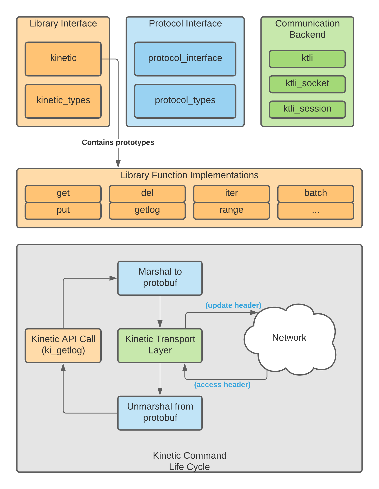

# libkinetic

Client library for connecting to, and communicating with, a kinetic key-value server.

## Build
### Prequisites
#### Ubuntu
- sudo apt install build-essential autoconf libtool libssl-dev libreadline-dev pkg-config

#### Google Protobuf v2.6.1
- wget https://github.com/google/protobuf/releases/download/v2.6.1/protobuf-2.6.1.tar.gz
- tar xzf protobuf-2.6.1.tar.gz
- cd protobuf-2.6.1
- sudo ./configure
- sudo make
- sudo make check
- sudo make install
- sudo ldconfig

#### Clone the source
- git clone --recurse-submodules https://gitlab.com/kinetic-storage/libkinetic.git
 **OR** 
- git clone https://gitlab.com/kinetic-storage/libkinetic.git
- cd libkinetic
- git submodule update --init --recursive
- cd ..

#### Prep protobuf-c
- cd libkinetic/vendor/protobuf-c
- ./autogen.sh
- cd ../../..

### Build
- cd libkinetic
- make
- make dist

## API Overview

### Library Overview

<figure align="center">
  
  <figcaption text-align:"middle">
    <strong>Figure 1</strong>
    Overview of library modules and how they fit in to a high-level overview of the lifecycle of a kinetic command.
  </figcaption>
</figure>

### Blocking Operations

Each blocking kinetic interface operation (e.g. `ki_del`) encompasses the end to end logic of:

	1. Access connection configuration

	2. Validate existence of function arguments

	3. Validate values of function arguments

	4. Create the kio (kinetic IO) structure

	5. Populate the request data of the kio structure (`kio->kio_sendmsg`)

	6. Pack request data (into protobufs) and send to the kinetic server

	7. Receive the response data from the kinetic server (`kio->kio_recvmsg`)

	8. Unpack response data into data structure (e.g. `kv_t`, `keyrange_t`, etc.)
